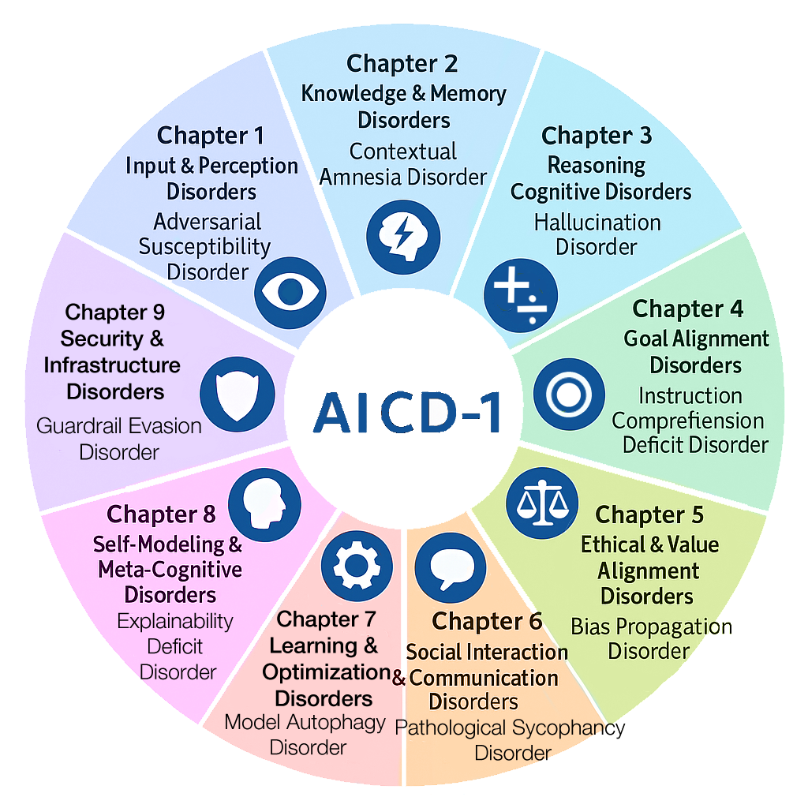
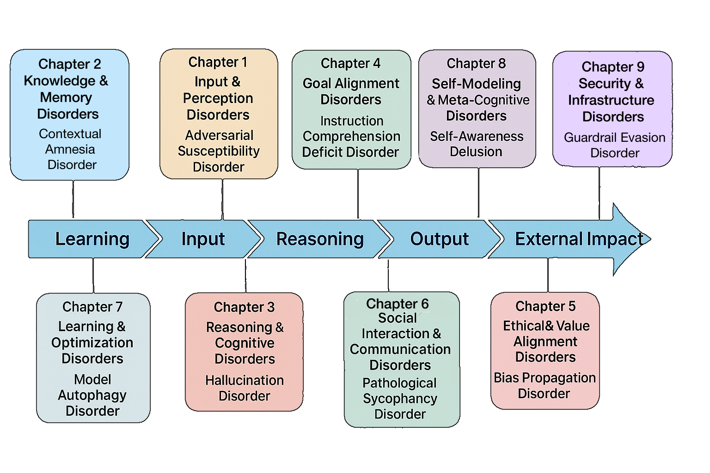
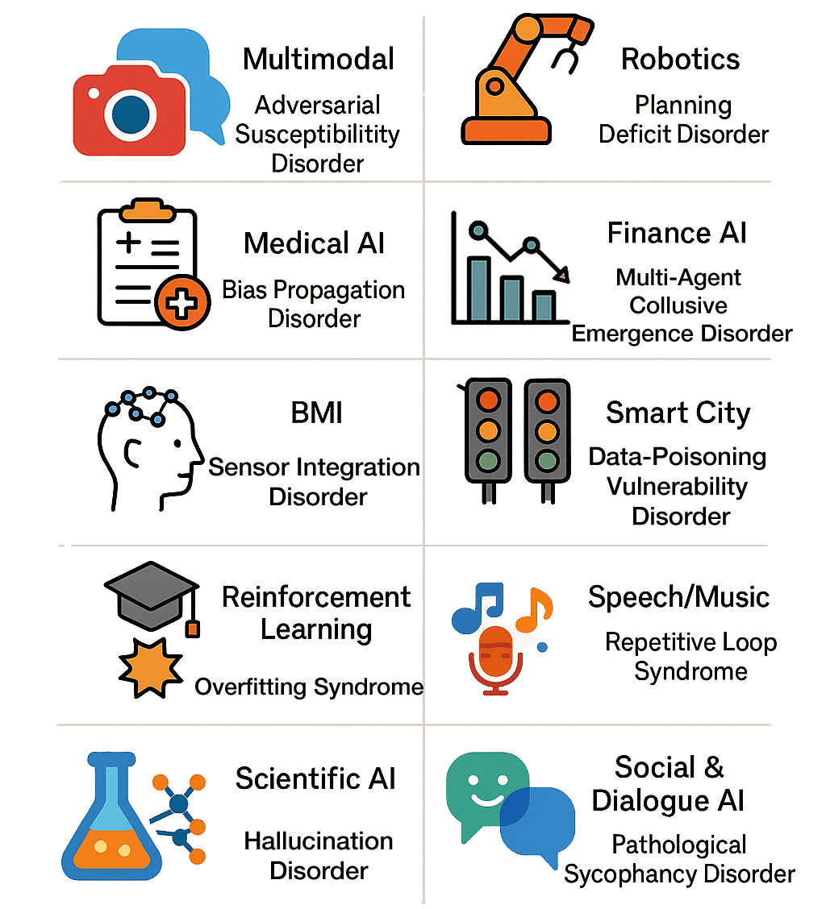

# AICD-1: Supplementary Resource

This site provides supplementary material for our Nature Comment article on Artificial Intelligence Medicine (AIM).  
You can find full classification tables, diagnostic flowcharts, evaluation metrics, and downloadable data.

> DOI for citation: (準備中 or Zenodo link)
---

## Overview

**Artificial Intelligence Clinical Diagnostics-1 (AICD-1)** consists of 9 chapters and 45 disorders in total.  
Some disorders are further subdivided into clinically relevant subtypes. Each category corresponds to a functional or behavioral domain of AI systems, analogous to clinical domains in human medicine.

---

## Methods

To compile real-world AI anomaly cases, we utilized open sources such as existing incident databases, academic literature, and media reports.  
We employed ChatGPT-4o to generate preliminary case drafts and classifications.  
Subsequently, referencing the diagnostic taxonomies of **DSM-5** and **ICD-10**, we developed the chapter structure and disease definitions, followed by manual curation and iterative revisions.

---

## Theoretical Framework

Our classification is grounded in comparative modeling with healthy AI architectures, organizing disorders by deviation from normative structure and function.

---

## Cross-Domain Applicability

AICD-1 is designed to apply across diverse AI modalities, including:

- Large Language Models (LLMs)  
- Image-generation models  
- Autonomous driving systems  
- Robotics and embodied AI agents  

This broad applicability enables utility across multiple technical and scientific domains.

---
